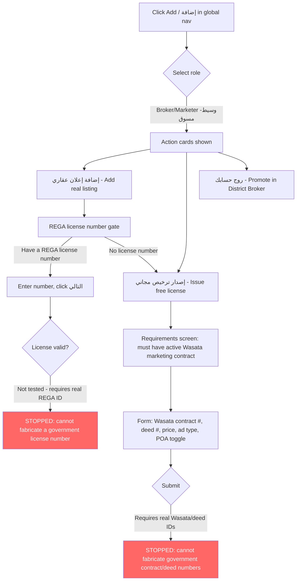
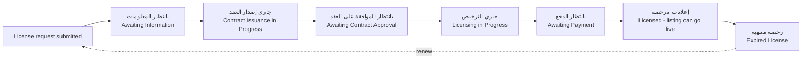
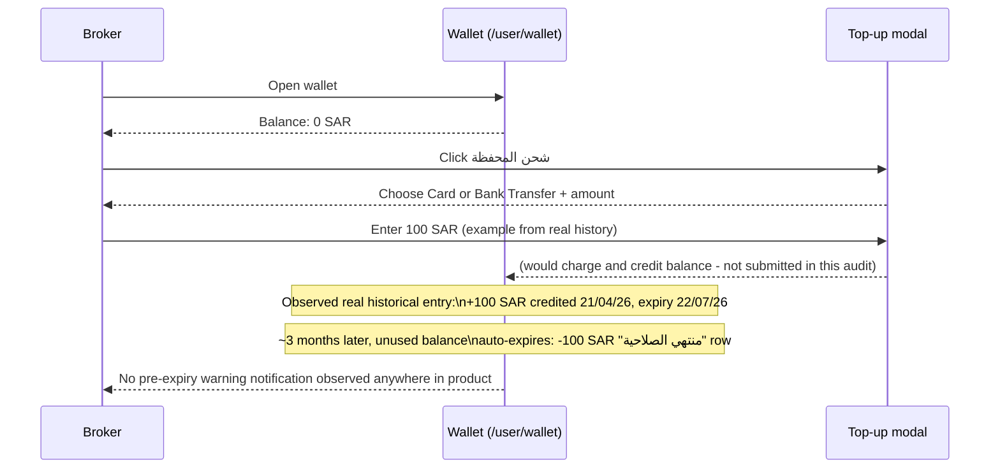
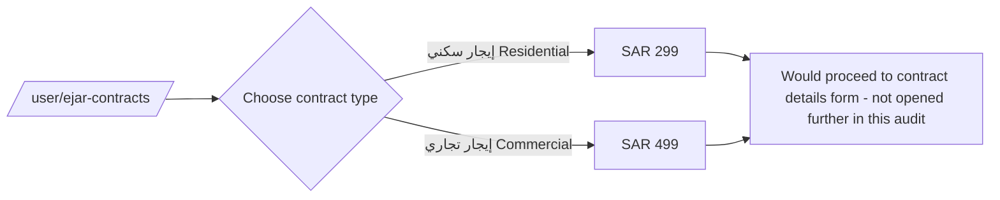
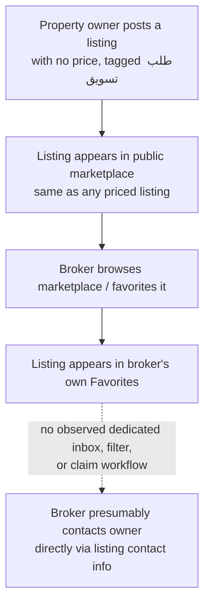

# User Journeys

End-to-end workflows as directly observed, up to the point where completion would have required a real government ID, a real payment, or real inventory that did not exist in the audited account. Points where the journey could not be completed are called out explicitly.

## Journey 1 — Create and Publish a Listing (Broker/Marketer role)



**Observed friction points**: no explanation of the difference between the three entry roles at step B; no inline help on Wasata/deed terminology at step K; the "free license" path exists specifically to unblock brokers who lack a REGA number already, but itself requires a different, equally specialized piece of paperwork (a Wasata contract) — so a broker with neither path's prerequisite has no route to publish at all through this flow.

## Journey 2 — License Lifecycle Tracking



Observed as seven independent filter tabs on `/mlr`, not as a single visual pipeline/progress-tracker component — the sequence above is reconstructed from the tab labels and their evident real-world ordering (paperwork → contract → licensing → payment → live → expiry), not from an in-product stepper UI. No in-product diagram or glossary connects these seven states to each other or to what a broker should do at each stage.

## Journey 3 — Wallet Top-Up and Expiry



**Business implication**: the wallet's expiry window creates real spend-it-or-lose-it pressure, but the absence of any observed pre-expiry warning means a broker can lose real money with no in-product nudge to spend it first — a monetization mechanic that currently reads as a silent forfeiture risk rather than a deliberately communicated feature.

## Journey 4 — District Broker Visibility Auction

```mermaid
flowchart TD
    A[/user/my-district-broker-bids/ - campaigns list] --> B[Click روج حسابك الآن]
    B --> C[/district-broker/bid/]
    C --> D{Select city}
    D -->|الرياض / جدة / الدمام| E{Select zone}
    E -->|e.g. شمال/شرق/غرب/جنوب/وسط الرياض| F[Bid amount entry]
    F -->|Requires real payment commitment| Z[STOPPED: not submitted - would place a real bid]
    style Z fill:#f66,color:#fff
```

**Naming-vs-implementation gap**: the feature is named "وسيط الحي" (Neighborhood Broker) but the selectable geographic unit is a broad compass-direction city zone, not a neighborhood — a broker cannot target, e.g., a single specific district, only one of ~5 large zones per city.

## Journey 5 — Featured Campaign Creation (broken path, no existing listings)

```mermaid
flowchart TD
    A[/user/campaigns/ - explainer page] --> B[Click ابدأ الخدمة]
    B --> C[/user/campaigns/new/]
    C --> D{Does broker have listings?}
    D -->|No - this account's actual state| E[BLANK SCREEN\nheading only, no picker, no empty-state CTA]
    D -->|Yes, hypothetically| F[Pick a listing]
    F --> G[Set daily budget]
    G --> H[Set campaign end date]
    H --> I[Campaign created - not reached in this audit]
    style E fill:#f66,color:#fff
```

This is a directly observed **dead end**, not an inferred one: navigating to `/user/campaigns/new` with zero existing listings renders the step-1 heading with a completely empty content area beneath it and no way forward.

## Journey 6 — Ejar Contract Notarization (paid documentation service)



Separately, assigned/existing Ejar contracts (contracts a broker is mediating, as opposed to contracts they are issuing) are tracked at `/user/broker-ejar-contracts` with a conversion-rate KPI (observed at 0% for this account, which had 0 assigned contracts) — these are two distinct features under similar naming ("عقود الإيجار" appears as a page title for both) that are easy to conflate.

## Journey 7 — Marketing Request Discovery (owner-seeks-broker lead flow)



This journey is reconstructed from static evidence (six pre-existing Favorites, several tagged "طلب تسويق") rather than walked end-to-end, since the audited account had no way to originate a new Marketing Request post as an owner within this session's scope. Flagged explicitly: the "contact owner" step is inferred from how every other marketplace listing on Aqar is known to work, not directly observed for this specific tag type — worth a follow-up pass before relying on this journey for build decisions.
