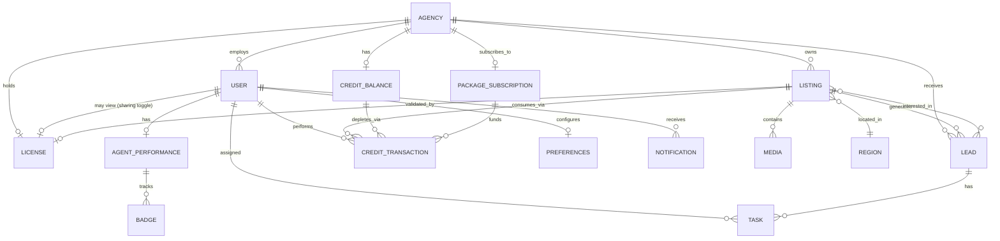

# Logical Data Model

No API or database was inspected directly — this model is reverse-engineered from UI fields, filters, table columns, and state transitions observed across the audit. Every entity is tagged:

- `[Observed]` — fields/relationships directly visible in the UI.
- `[Inferred]` — reasonable structure implied by the UI but not directly visible (e.g. a join table implied by a many-to-many relationship).

## Entities

### Agency `[Observed]`
Fields seen: name, website, phone (verified), city, national short address, address, description, logo, single owning FAL license.
Relationships: has many Staff (User); has one primary License `[Inferred: could be many licenses per agency in a larger org, only one was observed]`; has many Listings; has one Credit Balance; has one Package Subscription.

### User / Staff `[Observed]`
Fields seen: name, "Owner" designation, email, phone, credits limit, used credits. Personal profile additionally carries: service area (multi-district), languages, years of experience, bilingual agent bio (EN/AR, with an AI-generation button for both), profile photo.
Relationships: belongs to one Agency; has one User Profile; has Agent Performance metrics; can be granted visibility into the Agency's License (via the sharing toggle).

### License (FAL) `[Observed]`
Fields seen: license number, verified badge, CR Number, agency name, contact phone/email, address, Owner (User), "Valid until" date, "Share with agency staff" toggle.
Relationships: belongs to one Agency; referenced by many Listings via REGA ID `[Inferred link — REGA ID is a listing-level field and the FAL/CR numbers are agency-level, so the join is inferred, not directly shown]`.

### Listing `[Observed]`
Fields seen: price, currency, tier (Basic/Hot/Signature), completion/quality percentage (e.g. "64%"), purpose (For Sale/For Rent/Daily Rental), property type (Commercial Building, Complex, Exhibition Building, Residential Land, Commercial Land, etc.), area (Sq. M.), room count, full location (city/region/district), Bayut ID, REGA ID, posted/created date, status (Live/Not Posted/Insufficient Credits/Ad License Expired/Deleted), lifecycle tab (Active/Draft/Pending/Removed/Ad License Requests), performance snapshot (Views/Clicks/Leads), upgrade flags (which of Basic/Hot/Signature/Refresh/Photography/Videography/Drone have been applied).
Relationships: belongs to one Agency; created/posted by one User; has many Media (photos, implied by the photo-count badge in the preview panel); has many Leads; has many Credit Transactions (one per upgrade/refresh applied); has one Performance rollup.

### Media `[Inferred]`
Not directly enumerated (no media library screen was reached), but implied by: the photo-count badge on the listing preview panel, and the "Photography/Videography/Drone Footage Service" credit line items.
Inferred fields: type (photo/video/drone), URL, order/position, listing_id.

### Lead `[Observed]`
Fields seen: contact name (or "Unnamed Lead"), email/phone (redacted in captures but present as fields), channel (Call/WhatsApp/SMS/Email), message text (for WhatsApp), interested-in listing(s) (one observed lead spanned "+1 more properties" — implying a many-to-many, not strictly one Lead → one Listing), last interaction date, next planned task, source tag (TruLeads vs. "Bayut Match").
Relationships: belongs to one Agency; linked to one-or-many Listings; has many Tasks; `[Inferred]` has an implicit status/stage even though no pipeline-stage field was ever shown (the UI only exposes "has a next planned task" or not).

### Task `[Observed, minimally]`
Only "Add Task" / "Add New Lead" actions were observed; task fields (due date, type, assignee) were not enumerated because no task-creation form was completed.
Inferred fields: lead_id, due_date, type, assignee (User), completed (bool).

### Credit Balance `[Observed]`
Fields seen: Available, Used, Total, Current Plan.
Relationships: belongs to one Agency; consumed via many Credit Transactions.

### Credit Transaction `[Observed]`
Fields seen (from Credits Usage History): action type (Refresh, Signature Listing, Basic Listing, etc. — enumerated on the Usage Breakdown widget as Basic Listing/Hot Listing/Signature Listing/Refresh/Photography/Videography/Drone Footage), target listing (with its own denormalized snapshot: price, location, type, room/area), performer ("by Asbar Real Estate"), timestamp, credits consumed.
Relationships: belongs to one Agency; references one Listing; performed by one User (denormalized as agency name in the observed captures, not a specific staff member — `[Inferred]` a real implementation would attribute to the acting user).

### Package / Subscription `[Observed]`
Fields seen: tier name (Starter, Starter Pro, Bronze, Silver, Gold, Platinum, Platinum Plus, Titanium), price, credit allotment, duration (1 Year / 6 Months), per-tier caps ("up to N" Basic/Hot/Signature/Photography/Videography), discount percentage, "Current Package" flag, end date, top-ups purchased.
Relationships: belongs to one Agency; grants a recurring or one-time Credit Balance top-up.

### Agent Performance / TruBroker `[Observed]`
Fields seen: Leaderboard rank (or "Not Ranked"), TruPoints™ (numeric), three Badges (Quality Lister, Responsive Broker, Super Lister) each with Locked/Unlocked state and sub-metrics (Images Score %, Features Score %, Calls Answered %, WhatsApp Response %, Active Listings count vs. threshold).
Relationships: belongs to one User; aggregated at the Agency level into a team performance table (same fields, one row per staff member).

### Report / Analytics Snapshot `[Observed]`
Fields seen (Reports → Summary): listing composition counts by purpose/tier, location breakdown (district → count + %), performance time series (daily Views/Clicks/Leads/Calls/WhatsApp/SMS/Emails) filterable by purpose and tier, over a selectable date range (observed default: Last 30 Days).
Relationships: derived/aggregated from Listing + Credit Transaction + Lead data; not a stored entity in its own right, most likely a query-time rollup `[Inferred]`.

### Notification `[Observed]`
Fields seen: type/title (New Lead Alert!, Upgrade your listings!, Complete Your TruBroker Profile, Start Your TruBroker Journey), body text, relative timestamp, read/unread state ("Mark all as read" implies a read flag).
Relationships: belongs to one User; may reference a Lead, a Listing, or nothing (pure marketing nudge) — `[Inferred]` polymorphic reference.

### Region / Location `[Observed, partial]`
Fields seen: City (Jeddah, Taif, Samtah Jazan Region), District (Taiba District, Al Bashaer, Al Manar, Al Salehiyah, Al Falah, At Tahliyah, Al Sadad, Al Safa, Al Samer). No standalone location-management screen was reached; treated as a lookup dimension referenced by Listing and by the Reports location breakdown.

### Preferences `[Observed]`
Fields seen: Smart Credit Utilization (bool), Push Notification (bool), Image and Details Usage marketing consent (bool). Modeled as a 1:1 with User (observed) or Agency (ambiguous from the UI — the screen sits under "Settings" alongside personal User Settings, so cardinality is `[Inferred]`).

## Entity Relationship Diagram

## Notes on confidence

The highest-confidence entities are Listing, Credit Transaction, License, and Agent Performance — every field listed was read directly off a captured screen. The lowest-confidence areas are Media (never directly enumerated) and Task (only the trigger action was observed, not the resulting record), and the Lead↔Listing cardinality (inferred as many-to-many from a single observed multi-property lead, not confirmed against a data dictionary).
