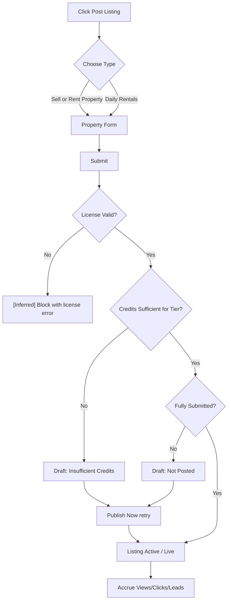
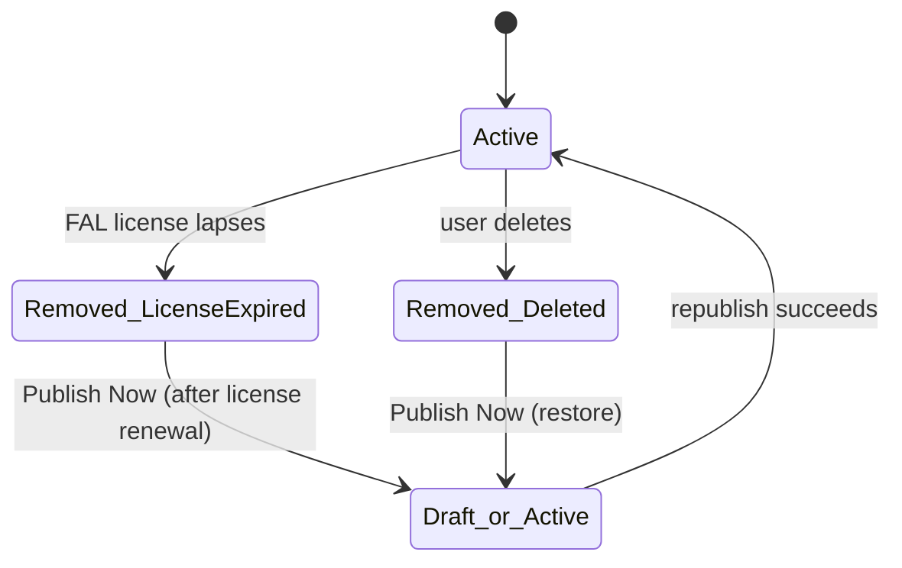
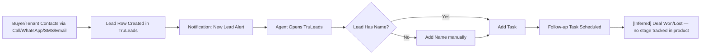
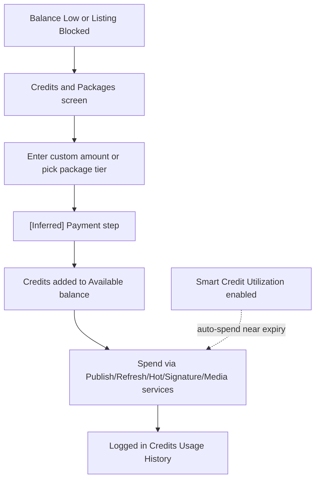
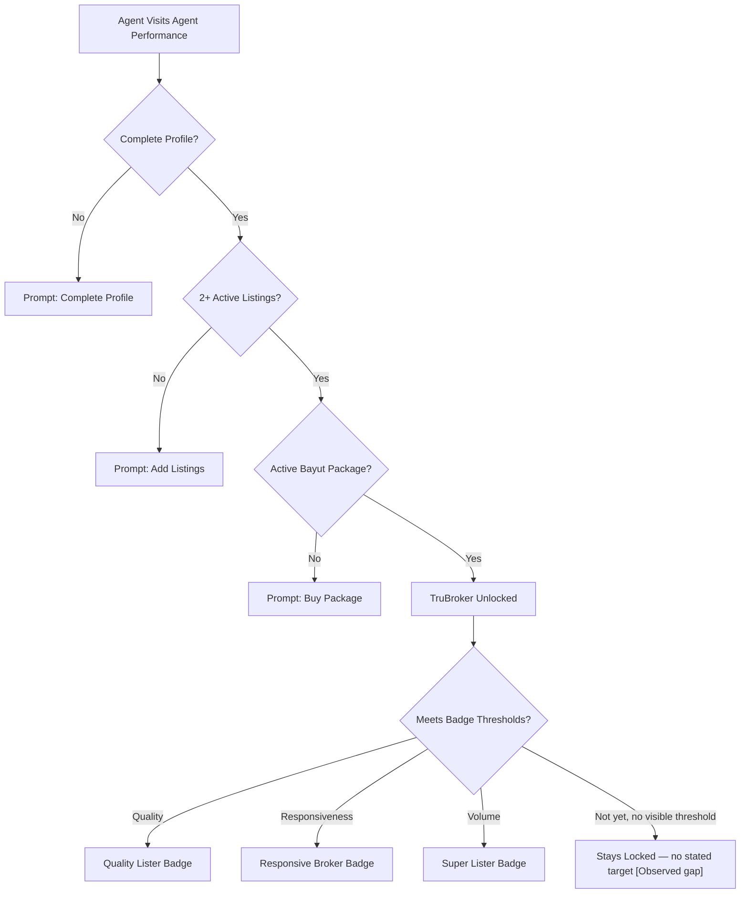
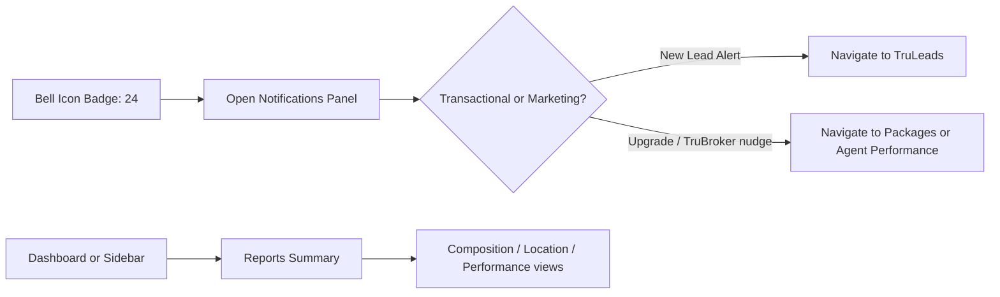

# User Journeys

Each journey is built from directly observed screens/states (`[Observed]`) plus reasonable completions where the audit account had no data to exercise a path (`[Inferred]`, always labeled inline). Diagrams use Mermaid `flowchart` or `stateDiagram-v2`.

---

## 1. Create & Publish a Listing

**Objective**: get a property from idea to a live, lead-generating listing.
**Trigger**: user clicks "Post Listing" (header button or sidebar item).
**Preconditions**: authenticated session; valid FAL license on file; sufficient credits for the intended tier (Basic is presumably free/included — `[Inferred]`, not confirmed since the audited account never hit a paywall on Basic).

- **User actions**: choose Sell/Rent Property vs. Daily Rentals → fill property form (fields not enumerated by this audit; Post Listing's first screen was only the type fork) → submit.
- **System actions**: `[Inferred]` validate REGA/property fields, check license validity, check credit balance for chosen tier, create listing record in Draft or Active state.
- **Validation**: `[Inferred]` REGA Ad License Number format/existence check (a filter for it exists on the listings table, implying it's a stored, queryable field).
- **Error paths `[Observed as end-states, not as live errors]`**:
  - Insufficient credits → listing lands in **Draft: Insufficient Credits**, with a "Publish Now" retry button and no inline top-up shortcut.
  - Incomplete/unsubmitted → **Draft: Not Posted**.
- **Success path**: listing appears in **Active**, accrues Views/Clicks/Leads, and gets a "Live" status pill.
- **Decision points**: tier selection (Basic/Hot/Signature) — `[Inferred]` likely selected during the form, since active listings show a tier tag.
- **Recovery path**: from Draft, "Publish Now" once credits are topped up (observed button; the top-up flow itself is a separate, disconnected screen).
- **UX observations**: the fork screen gives zero pre-flight guidance (required docs, media standards, credit cost) before committing time to the form.
- **Improvement opportunity**: show estimated credit cost and license-validity check *before* the user starts filling the form, not after submission.

---

## 2. Listing Falls Out of Active Status (Expiry / Deletion)

**Objective**: understand why a listing left Active and how to recover it.
**Trigger**: FAL license lapses, or a user manually deletes a listing.
**Preconditions**: listing was previously Active.

- **System actions `[Observed via end-state]`**: on license lapse, all listings tied to that license move to **Removed: Ad License Expired**; lifetime Views/Clicks/Leads are preserved on the row.
- **User actions**: user can revisit Settings → Licenses to renew (renewal flow itself not exercised — no expired license was available to test).
- **Recovery path**: "Publish Now" appears on Removed rows for both "Ad License Expired" and "Deleted" — `[Inferred]` republishing likely re-validates the same preconditions as a fresh listing (license, credits).
- **UX observation**: nothing on the Removed tab links back to *which* license expired or to the Licenses screen directly; nothing on the Licenses screen lists *which* listings are attached to it.
- **Improvement opportunity**: bidirectional link between a license's expiry date and its dependent listings, with a pre-expiry warning surfaced on the Dashboard/Notifications, not discovered after the fact on the Removed tab.

---

## 3. Receive and Work a Lead

**Objective**: convert an inbound inquiry into a follow-up and, eventually, a deal.
**Trigger**: a prospective buyer/tenant calls, WhatsApps, or messages via a Bayut listing.
**Preconditions**: listing is Active and has at least one channel (phone/WhatsApp) attached.

- **System actions `[Observed]`**: a new row appears in TruLeads (Lead Details, Last Interaction, Interested In, Next Planned Task); a matching "New Lead Alert!" appears in Notifications within roughly the same window (observed timestamps: "2 days ago" on two separate lead alerts, consistent with near-real-time push).
- **User actions**: open TruLeads, review lead detail (channel, message text if WhatsApp, listing interested in), click "Add Task" to schedule follow-up, optionally "Add Name" for leads captured without one ("Unnamed Lead" observed as a real state).
- **Decision points**: which listing a multi-property lead is tied to (one observed lead was linked to "+1 more properties").
- **Error/edge paths `[Observed]`**: "Unnamed Lead" — the channel captured a phone number or click but no name, and the UI's only recovery is a manual "Add Name" action, i.e. no auto-enrichment.
- **Recovery path**: none automated — a lead with no name or a missed call sits in the table until a human acts.
- **UX observation**: no SLA timer, no lead scoring, no automatic reassignment if a task is overdue — the workflow is list-and-manual-action, not managed.
- **Improvement opportunity**: auto-enrich "Unnamed Lead" from caller ID/WhatsApp profile where available; SLA countdown visible directly in the table row, not just as a raw "Last Interaction" date.

---

## 4. Credits: Top-Up and Spend

**Objective**: keep enough balance to publish and upgrade listings.
**Trigger**: Draft listing blocked on Insufficient Credits, or proactive top-up.
**Preconditions**: active payment method `[Inferred, not observed — no payment form was reached in this audit]`.

- **User actions**: Credits & Packages → enter custom credit amount → "Get Top-up" (not completed in this audit — payment step not exercised).
- **System actions `[Observed via resulting state]`**: credits added to Available balance; Credits Usage ledger logs each spend event with listing, action type (Refresh, Signature Listing, etc.), timestamp, and credit amount (observed entries e.g. "Refresh applied to listing ... 5 Used", "Signature Listing applied ... 30 Used").
- **Automation branch `[Observed as a toggle, not a live event]`**: if "Smart Credit Utilization" (Preferences, on by default) is enabled, the system may auto-spend credits nearing expiry on boosts — no confirmation step or spend log entry distinguishing auto-spend from manual spend was found.
- **UX observation**: no forecast of "at current burn rate, credits last N days" anywhere in Credits Usage or Reports.
- **Improvement opportunity**: burn-rate forecast and an explicit, filterable log line for auto-spend vs. manual spend.

---

## 5. Agent Performance / TruBroker Progression

**Objective**: unlock TruBroker™ status and quality/responsiveness badges.
**Trigger**: agent visits Agent Performance, or is nudged via Notifications/Dashboard.
**Preconditions**: at least 1 active listing and a partially complete profile (observed: 90% complete, 12 active listings — well above the "2+ Active Listings" TruBroker prerequisite, yet TruBroker itself was not yet unlocked, implying "Complete Profile" and "Active Bayut Package" gates were the blockers).

- **User actions**: Complete Profile → maintain 2+ Active Listings → hold an Active Bayut Package (all three shown as a checklist).
- **System actions `[Observed]`**: computes Images Score (4.58%) and Features Score (55%) per listing/agent, Calls Answered % and WhatsApp Response % (both "-" i.e. no data yet), Active Listings count (0/20 toward "Super Lister").
- **Decision point**: none exposed — badges are computed, not chosen.
- **Success path**: `[Inferred]` badge flips from Locked to Unlocked once thresholds are met; threshold values themselves were never disclosed anywhere in the UI.
- **UX observation**: this is the clearest "visible game, invisible win condition" pattern in the product — every input is measured and shown, but no target/threshold is ever stated.
- **Improvement opportunity**: show the actual threshold (e.g. "Quality Lister needs Image Score ≥ 80%, you're at 4.58%") next to every Locked badge.

---

## 6. Reports & Notifications Consumption

**Objective**: stay informed of account/portfolio health without hunting for it.
**Trigger**: passive — dashboard visit, or header bell.

- **User actions**: open Notifications panel; optionally "Mark all as read"; separately, visit Reports → Summary for deeper composition/location/performance views.
- **System actions `[Observed]`**: Notifications mixes transactional (2× "New Lead Alert!") with lifecycle/marketing (Upgrade your listings!, Complete Your TruBroker Profile, Start Your TruBroker Journey) in one reverse-chronological feed with relative timestamps.
- **UX observation**: no filter/tab to separate "things that need action" from "things that are marketing"; a user checking for a missed lead must scroll past onboarding nudges.
- **Improvement opportunity**: split streams (Activity vs. Recommendations), and let Reports Summary answer "compared to what" (previous period, market average) instead of only "what happened."

