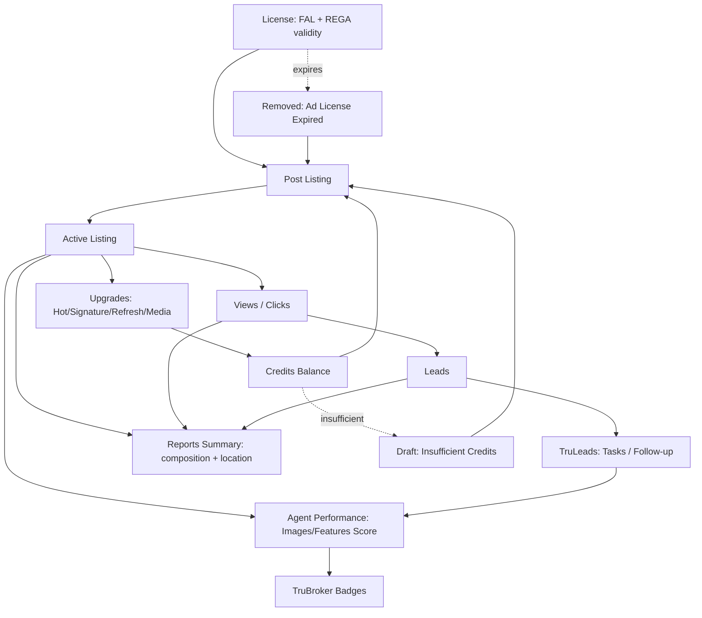

# Feature Dependency Graph

How the modules actually depend on each other, based on observed data flow (a number/state appearing on one screen that could only be produced by another screen's underlying data).

## Primary value chain

## Dependency notes (why each edge exists)

- **License → Post Listing**: every listing carries a REGA ID, which the Licenses screen frames as flowing from the agency's FAL license; a lapsed license produces "Ad License Expired," so publishing is gated on license validity. `[Inferred from state names, license→listing linkage not directly tested]`
- **Credits Balance → Post Listing**: Draft's "Insufficient Credits" status is a direct, observed dependency — publishing above the free tier consumes the Credits Balance.
- **Active Listing → Views/Clicks → Leads**: directly observed performance funnel on every listing row and on the Dashboard/Reports Performance widgets.
- **Leads → TruLeads Tasks**: "Add Task" is the only lead-management action beyond viewing, directly observed.
- **Upgrades → Credits Balance**: every upgrade type (Hot, Signature, Refresh, Photography, Videography, Drone) is logged as a Credits Usage History entry with a credit cost — a closed loop back into the balance.
- **Active Listing + TruLeads → Agent Performance**: Images/Features Score is listing-derived; Calls Answered/WhatsApp Response is lead-interaction-derived — Agent Performance is a **derived/aggregate feature**, not a primary data source. This matters architecturally: it cannot be built before Listings and TruLeads exist, and any bug in either upstream feature silently corrupts TruBroker scoring.
- **Agent Performance → TruBroker Badges**: badges are computed thresholds over the same scores shown in Agent Performance — confirmed by the sub-metrics displayed directly under each Locked badge.
- **Active Listing + Views + Leads → Reports Summary**: Reports is a rollup of data already present on Dashboard/Listings, not a new data source (see [[09_ANALYTICS_REVIEW]] — this is why it reads as duplicative rather than additive).
- **License expiry / Credit shortfall → recovery loop back into Post Listing**: both Draft and Removed's "Publish Now" route back into the same publish path, i.e. there is really only **one** publish entry point in the data model, reached from three different UI locations (Post Listing, Draft tab, Removed tab).

## Architectural implication for Tuba

Because Agent Performance/TruBroker and Reports Summary are both **pure derivatives** of Listings + Credits + TruLeads data (no independent data entry of their own was found), Tuba can sequence its build to ship the three primary modules (Listings, Credits, Leads) first and layer gamification and reporting on top **without needing separate data-entry UI for either** — they're computation/presentation layers, not new domains. This directly informs the phased roadmap in [[35_PRODUCT_ROADMAP]].

## Critical path / single point of failure

The **License** entity is a hard upstream dependency for the entire Active-listing branch of the graph (Post Listing, Views/Clicks, Leads, Agent Performance, Reports) — nothing downstream of it self-heals if the license lapses; every dependent listing moves to Removed simultaneously. `[Inferred from the "Ad License Expired" status applying uniformly, not from directly watching a lapse happen]` Tuba should treat license-expiry-forecasting as an early-priority feature precisely because of this fan-out, not because it's a large feature in isolation — see [[18_AI_OPPORTUNITIES]] and [[34_AI_ARCHITECTURE]] for the recommended AI-assisted version.
