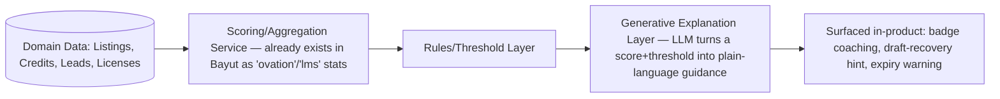

# AI Architecture

This extends [[18_AI_OPPORTUNITIES]] (a flat opportunity list from the Product Audit) with **where each capability plugs into the data model and feature dependency graph** from this phase, plus explicit ranking. One data point worth noting: Bayut already ships a narrow generative-AI feature today — a "Generate Agent Description (English)" / "إنشاء وصف الوكيل (بالعربية)" button on the agent-bio textarea in User Settings `[Observed]` — so bilingual short-copy generation is a proven, low-risk pattern to extend, not a novel bet.

## Ranked opportunities

| Opportunity | Plugs into (data model) | Business Value | Complexity | Expected ROI | Priority |
| --- | --- | --- | --- | --- | --- |
| TruBroker-style badge coaching ("you need X more") | Agent Performance scores (Images/Features Score, response rates) — pure presentation layer on existing computed data | High | Low | High (cheap to build, directly fixes an observed UX gap) | P0 |
| License-expiry risk forecasting | License.valid_until + Listing.license_id fan-out (see [[32_FEATURE_DEPENDENCY_GRAPH]]) | Very High | Low–Medium | High (prevents involuntary listing removal — a revenue-protecting feature) | P0 |
| Listing quality/completeness scoring at publish time | Listing fields + Media count, same inputs TruBroker already scores post-hoc | High | Medium | High | P0 |
| Draft-recovery assistant (minimum top-up calculator) | Credit Balance + Draft.status=Insufficient Credits + Package tier pricing | Medium | Low | Medium | P1 |
| Bilingual property description generation | Listing fields → generated copy (extends the already-shipped agent-bio generator pattern) | High | Low–Medium | High | P1 |
| Lead scoring | Lead channel/message/response-time + Listing price/type/location | Very High | Medium–High | High | P1 |
| Unnamed-lead auto-enrichment | Lead.phone/whatsapp_profile → Lead.name | Medium | Medium (depends on channel data access) | Medium | P1 |
| Image quality analysis (blur, coverage, watermark) | Media entity — feeds directly into TruBroker's existing "Images Score" | High | Medium | Medium–High | P1 |
| Duplicate listing detection | Listing fields (address, price, type) across Agency scope | Medium | Medium | Medium | P2 |
| Pricing suggestions | Listing fields + Reports location-breakdown + `[Inferred]` external comps | High | High (needs market data Bayut/Tuba may not fully have in-house) | Medium | P2 |
| Notification-stream triage (transactional vs. marketing ranking) | Notification entity, mixed today | Medium | Low | Medium | P2 |
| Natural-language search across listings/leads/staff | Cross-entity (Listing, Lead, User) — no equivalent exists in Bayut today (see [[26_UX_PATTERN_LIBRARY]] confirmed-absent global search) | Medium–High | Medium–High | Medium | P2 |
| Conversational assistant (agent/admin copilot) | All of the above, as tool-calling surfaces | High (long-term) | High | Medium (long payback) | P3 |
| Predictive analytics (expected views/clicks/leads) | Reports time-series data, already server-aggregated (see [[31_API_ARCHITECTURE_INFERENCE]]) | Medium | High | Low–Medium (harder to make actionable than diagnostic AI) | P3 |

## Why this ranking

The P0 items share a property: **the data already exists and is already computed** (TruBroker scores, license expiry dates, listing fields) — they're presentation/reasoning layers on top of existing pipelines, not new data-collection projects. This mirrors the Feature Dependency Graph finding that Agent Performance and Reports are derivative features: AI here means *making an existing derivative smarter*, which is materially cheaper than building new instrumentation (lead scoring, image analysis) from scratch.

The P2–P3 items either need new data Tuba doesn't have yet from this audit alone (market comps for pricing suggestions) or are genuinely large scope (a full conversational assistant) — worth sequencing after the cheap, high-confidence wins prove the pattern.

## Architecture pattern for the P0/P1 tier

The key architectural point: **the generative layer sits downstream of deterministic scoring**, not in place of it. Badge thresholds, credit shortfalls, and license expiry dates are all exact, computable facts — AI's job in the P0 tier is turning an exact fact into a well-written, specific next action, not guessing the fact itself. This keeps the highest-value features low-risk (no hallucination surface on the numbers that matter) while still delivering the "the game is visible but not actionable" fix identified throughout this audit.

## Guardrails worth stating explicitly for Tuba

- Any AI feature touching pricing suggestions or lead scoring should expose its inputs/reasoning to the agent (a transparent score breakdown, matching the pattern Bayut already uses for TruBroker's own Image/Features Score) rather than a black-box number — consistent with the trust-building theme identified in [[28_PRODUCT_PHILOSOPHY]].
- Generative description features (already proven low-risk by Bayut's own bilingual bio generator) should always leave the human editing the output before publish, not auto-publish — REGA/compliance risk on inaccurate generated property descriptions is real.
