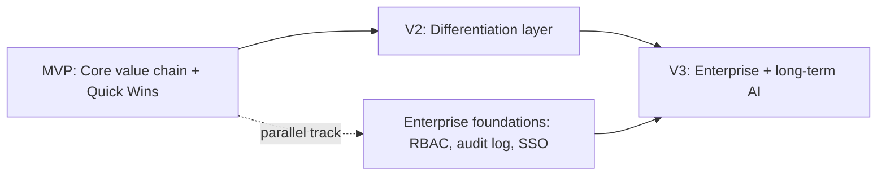

# Product Roadmap

Sequencing follows the dependency logic established in [[32_FEATURE_DEPENDENCY_GRAPH]] (primary entities before derivative/computed features) and the priority calls made per-feature in [[30_TUBA_NEXT_GENERATION_SPEC]].

## MVP — core value chain

Goal: a single-seat agency can publish, get found, and respond to leads — end to end — without hitting any of Bayut's observed dead ends.

- Listings: create/edit/publish, Active/Draft/Removed lifecycle **with a unified status glossary and correct per-cause fix actions** (fixes the #1 weakness found in the audit; see spec §1)
- License record with expiry tracking and a visible dependent-listings list (spec §6)
- Credits: balance, manual spend, opt-in (not default-on) auto-spend with a full log (spec §2)
- Leads: table view, channel attribution, task creation, SLA-age indicator (spec §3, MVP slice only — no pipeline board yet)
- Agent Performance: same scoring model as TruBroker, but **every badge discloses its threshold and current distance** from day one (spec §4 — cheapest, highest-leverage single change in this whole roadmap)
- Basic reporting: dashboard KPIs with explicit comparison baselines (spec §5, MVP slice)
- Notifications: single feed is acceptable for MVP, but architect it as the pub/sub event pipeline from day one (spec §8) so later features don't require a rebuild

## Quick Wins (ship inside or immediately after MVP, low effort/high visibility)

- TruBroker-style badge threshold disclosure (spec §4) — days, not weeks, of work
- Draft-recovery "how many more credits do you need" calculator (spec §1 / [[34_AI_ARCHITECTURE]])
- KPI cards stating their comparison baseline instead of a bare percentage
- Bilingual AI-generation extended from agent bio to agency description (spec §9)
- Consent toggles defaulted off, not on (spec §9)

## V2 — the differentiation layer

Goal: features that make a growing agency choose Tuba over Bayut specifically, not just "an equivalent tool."

- Lead pipeline board + scoring + auto-enrichment (spec §3)
- Role-based permissions (six-role model) + audit log (spec §7)
- License-expiry predictive notifications, fanned out to affected agents (spec §6)
- Reports as a genuinely distinct module: report builder, CSV export, scheduled delivery (spec §5)
- Credit ROI panel + package-tier recommendation (spec §2)
- Bulk actions and saved views across Listings and Leads (confirmed absent in Bayut — [[26_UX_PATTERN_LIBRARY]])
- Global search across listings/leads/staff (confirmed absent in Bayut)

## V3 — long-term / enterprise

- Multi-license, multi-branch agency support (spec §6, §7)
- Branch-scoped leaderboards (spec §4)
- Natural-language query over reports ([[34_AI_ARCHITECTURE]] P2/P3)
- Duplicate-listing and duplicate-lead detection (spec §1, §3)
- Pricing suggestions (needs market-comp data — sequence after Tuba has enough of its own transaction volume, per [[34_AI_ARCHITECTURE]])
- Conversational agent/admin copilot ([[34_AI_ARCHITECTURE]] P3)

## Enterprise-specific features (parallel track, not strictly sequential)

- Full RBAC with branch scoping
- Audit log with export (compliance requirement for larger brokerages)
- SSO/OIDC (mirroring the identity-provider separation pattern Bayut itself uses — [[31_API_ARCHITECTURE_INFERENCE]])
- Per-branch reporting rollups

## AI features (cross-referenced from [[34_AI_ARCHITECTURE]], sequenced by data-readiness, not calendar time)

| Phase | Features | Why this phase |
| --- | --- | --- |
| MVP/Quick Win | Badge coaching copy, draft-recovery calculator | Deterministic inputs already exist; LLM only writes the explanation |
| V2 | Lead scoring (rules-based first), image quality analysis, bilingual description generation | Needs the Leads/Media modules to exist first |
| V3 | Duplicate detection, NL report query, pricing suggestions, conversational assistant | Needs either scale (duplicate detection), a mature reporting layer (NL query), or external market data (pricing) |

## Future integrations (not scoped in detail here — flagged for separate discovery)

- Payment gateway abstraction beyond a single provider (not directly observed in this audit — the top-up payment step was never exercised)
- WhatsApp Business API direct integration (currently, WhatsApp leads arrive as inbound clicks-to-chat; a deeper integration could enable in-app reply)
- Government/REGA API integration for real-time license validation (Bayut's own FAL/REGA fields imply this exists on their side; Tuba should evaluate direct integration rather than manual entry)

## Recommended release plan

**MVP** → single-seat and small-team agencies get full value with zero of Bayut's observed dead-ends. **V2** → the release that actually competes for agencies currently on Bayut, HubSpot-lite tools, or spreadsheets — this is where Tuba's differentiation claims become concrete. **V3** → enterprise/multi-branch readiness, positioned for agencies that have outgrown both Bayut Profolio and generic CRM tooling.

