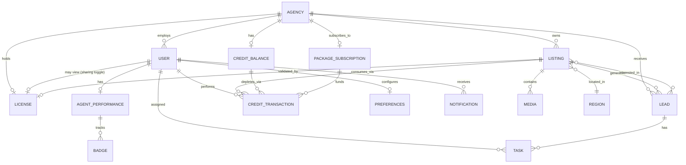
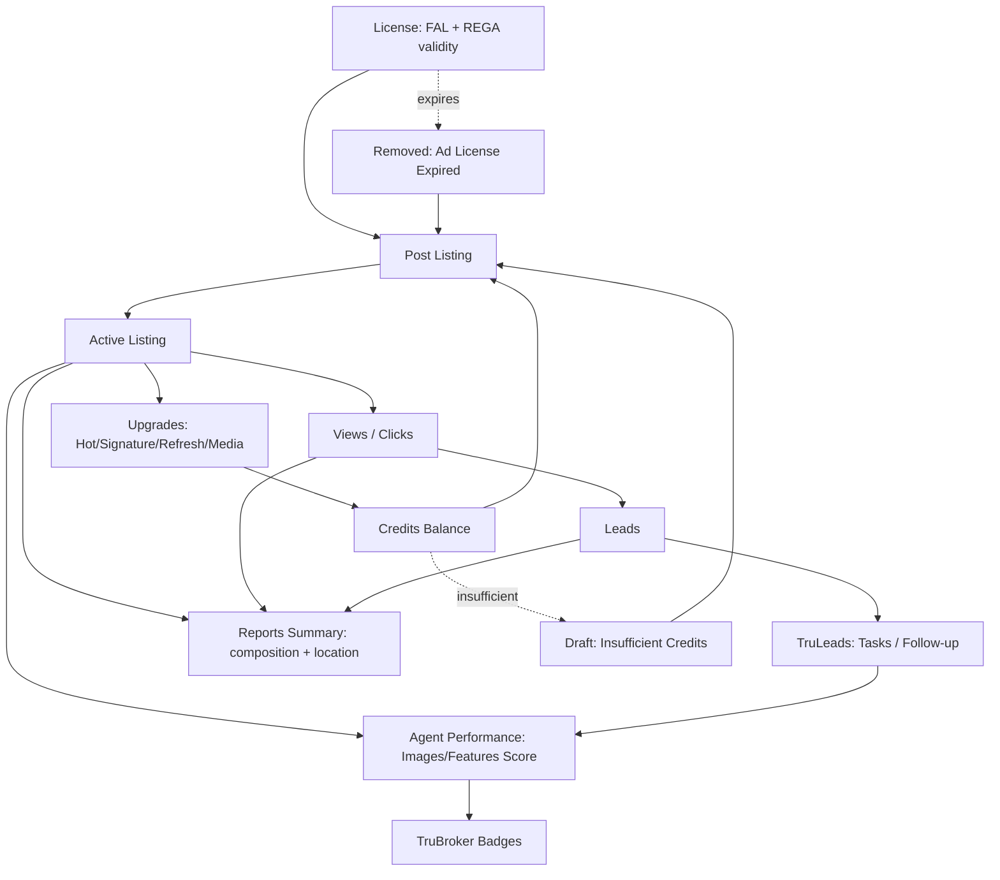
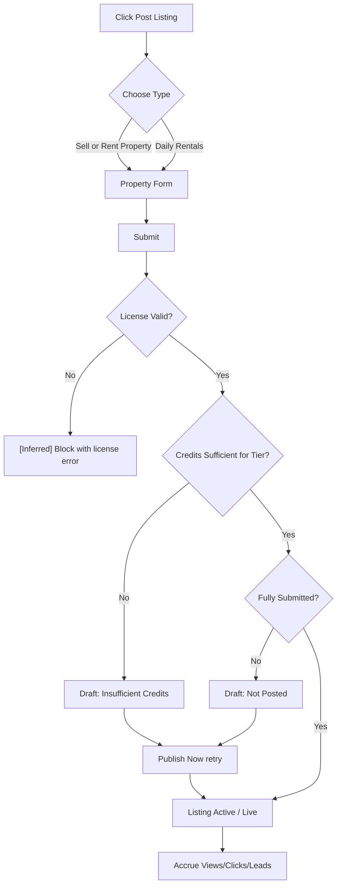
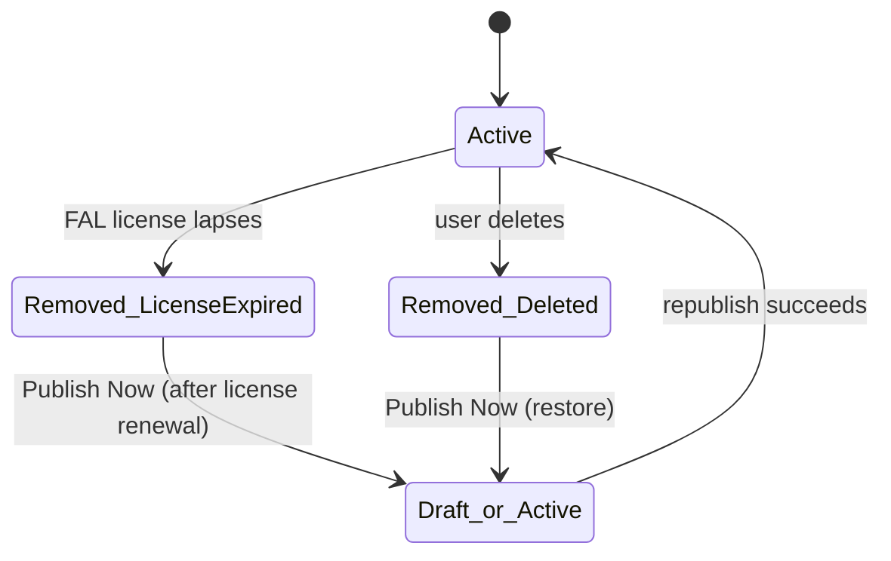
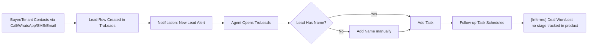
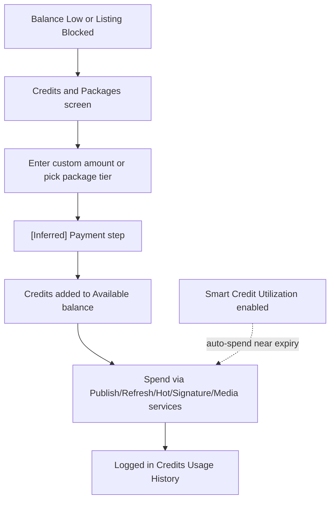
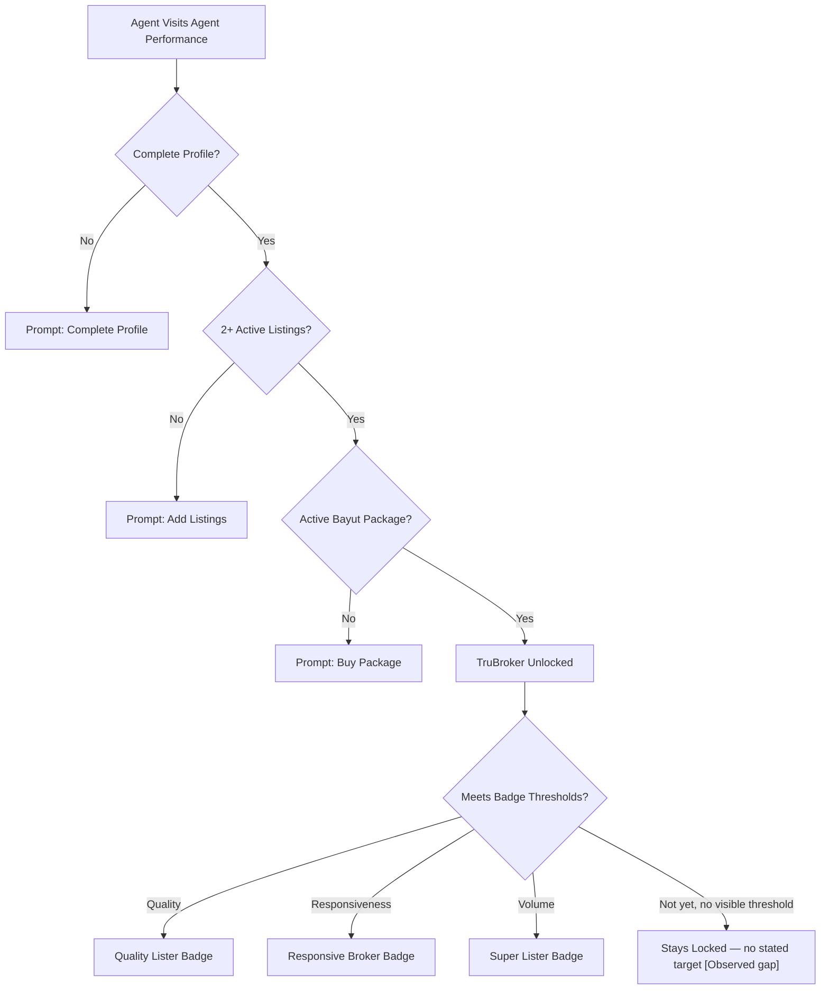
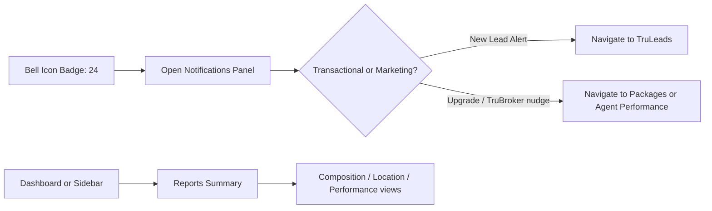
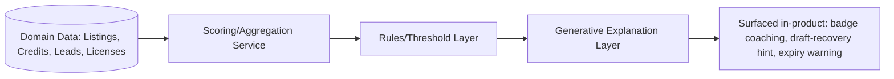
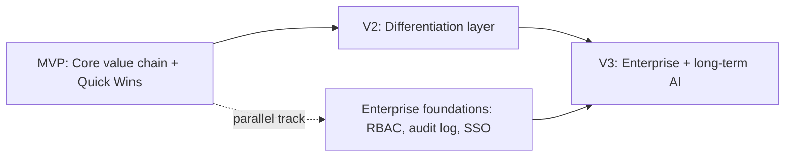

# Consolidated Mermaid Diagrams

All diagrams from this phase (and the Phase 1 audit) in one place for quick reference. Source of truth for the Phase-1 diagrams is `diagrams/*.mmd`; source of truth for Phase-2 diagrams is the individual documents linked below — this file is a convenience index, not a new source.

## Site Map (Phase 1 — `diagrams/site-map.mmd`)

See [[03_INFORMATION_ARCHITECTURE]] and `diagrams/site-map.mmd`.

## Permissions (Phase 1 — `diagrams/permissions.mmd`, superseded in detail by Phase 2)

See [[27_PERMISSION_MATRIX]] for the full matrix; `diagrams/permissions.mmd` for the flow diagram.

## Listing Workflow (Phase 1 — `diagrams/workflow.mmd`)

See `diagrams/workflow.mmd`, extended in Journey 1 and 2 below.

## Feature Map (Phase 1 — `diagrams/feature-map.mmd`)

See `diagrams/feature-map.mmd`.

---

## Entity Relationship Diagram (Phase 2 — [[23_DATA_MODEL]])

## Feature Dependency Graph (Phase 2 — [[32_FEATURE_DEPENDENCY_GRAPH]])

## User Journey: Create & Publish a Listing (Phase 2 — [[29_USER_JOURNEYS]])

## User Journey: Listing Falls Out of Active Status (Phase 2 — [[29_USER_JOURNEYS]])

## User Journey: Receive and Work a Lead (Phase 2 — [[29_USER_JOURNEYS]])

## User Journey: Credits Top-Up and Spend (Phase 2 — [[29_USER_JOURNEYS]])

## User Journey: TruBroker Progression (Phase 2 — [[29_USER_JOURNEYS]])

## User Journey: Reports & Notifications Consumption (Phase 2 — [[29_USER_JOURNEYS]])

## AI Architecture Pattern (Phase 2 — [[34_AI_ARCHITECTURE]])

## Roadmap Sequencing (Phase 2 — [[35_PRODUCT_ROADMAP]])

